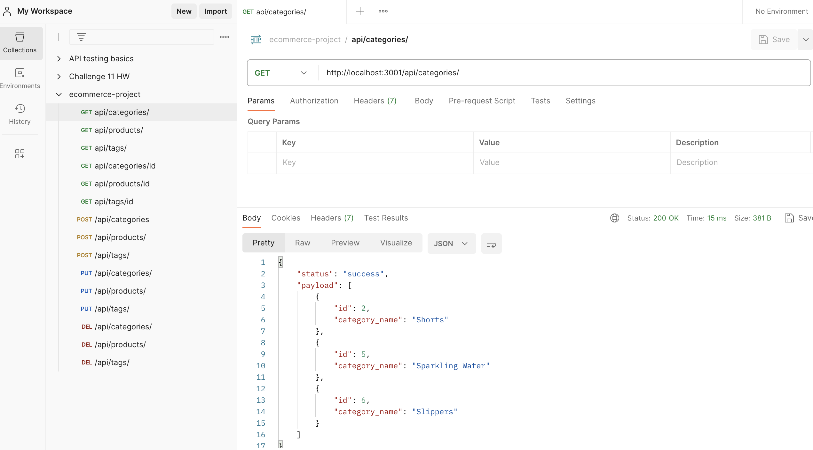
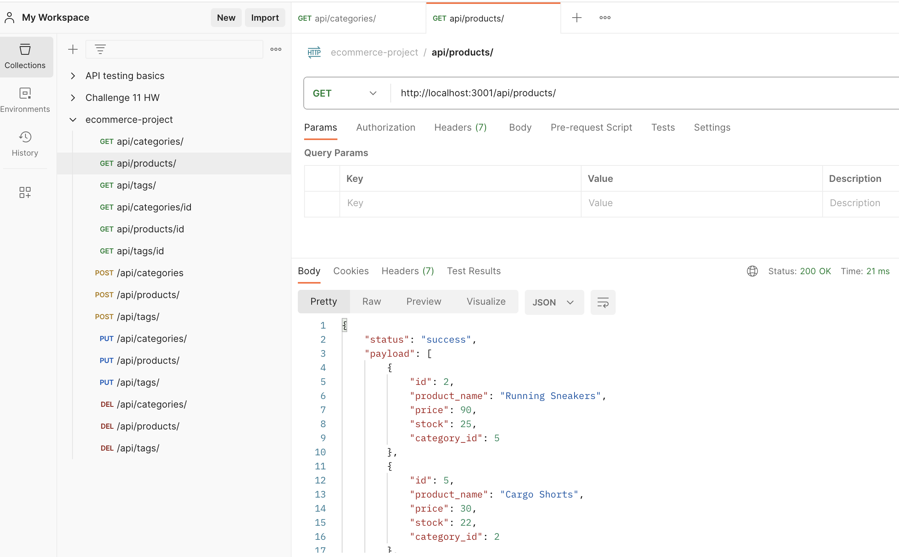
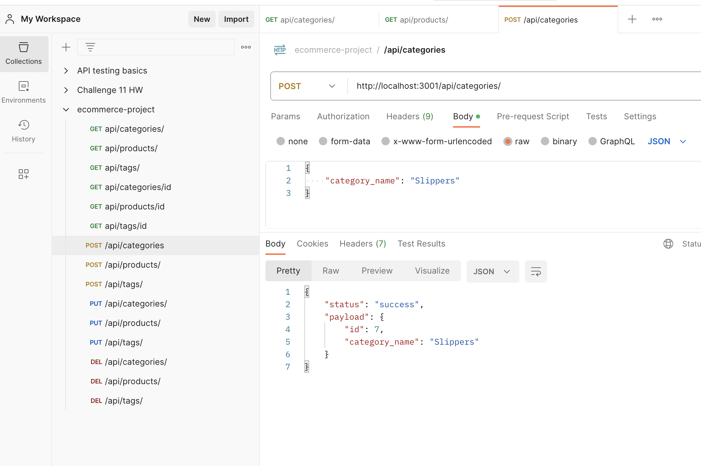

# ecommerce-backend project

## Project Description
This project entailed building a back end for an e-commerce site using starter code. In this project, an individual will configure a working Express API and utilize mySQL database and Sequelize.

In the beginning, it required creating a schema.sql, setting up the configuration with a dotenv file. From there, one will need to create models for each table and routes to pair with them. After completion, in the terminal run "npm run dev" and utilize POSTMAN to test your routes. 

## Technical Requirements
This project used:
* sequelize
* mySQL
* Express
* dotenv
* POSTMAN 

## Usage
Github Link:https://github.com/lavollmer/ecommerce-backend

Video Submission:https://drive.google.com/file/d/13D4RGf8XrQD78kG2QxchkzWWwzDr0Cn9/view

Screenshots:

## Credit
This project was done in conjunction with the U of MN Bootcamp Fall 2023. 

Tutoring services were used to discuss big picture topics such as models, routes, and seeding. 

U of MN bootcamp Xpert Learning Assistant was used to understand GET request in POSTMAN for http://localhost:3001/api/categories/1 it returns a null value, with an error. Additionally, it was asked to help with 
in POSTMAN I am getting this error for my PUT request { "status": "error", "sendback": "Missing where attribute in the options parameter"} debugging.

U of MN bootcamp Xpert Learning Assistant provided code for due to seeding issues:
ALTER TABLE ProductTag
DROP FOREIGN KEY producttag_ibfk_2;

ALTER TABLE ProductTag
DROP FOREIGN KEY producttag_ibfk_1;

## License
No license